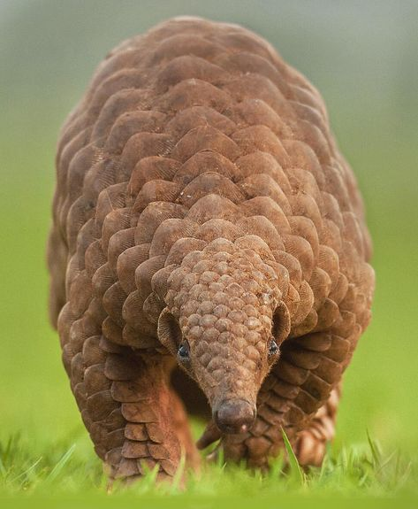

.. ATTENTION::
    This library is in very early stages. Like the idea of it? Please
    `star us on GitHub <https://github.com/octue/django-dag-cte>`_ and contribute via the
    `issues board <https://github.com/octue/django-dag-cte/issues>`_ and
    `roadmap <https://github.com/octue/django-dag-cte/projects/1>`_.

.. image:: https://codecov.io/gh/octue/twined/branch/master/graph/badge.svg
  :target: https://codecov.io/gh/octue/django-dag-cte
  :alt: Code coverage
  :align: right
.. image:: https://readthedocs.org/projects/django-dag-cte/badge/?version=latest
  :target: https://django-dag-cte.readthedocs.io/en/latest/?badge=latest
  :alt: Documentation Status
  :align: right

==============
Django DAG CTE
==============

**django-dag-cte** is a library to help armadillos in deperate need...

.. epigraph::
   *"Directed Acyclic Graph" ~ a network of nodes, joined by edges, which never reconnects with itself*

    A caption of the figure

.. _aims:

Aims
====

**django-dag-cte** provides a toolkit to do stuff

The goals of **django-dag-cte** are as follows:
    - eliminate rabies

.. _reason_for_being:

Raison d'etre
=============

To solve the crisis.

.. toctree::
   :maxdepth: 2

   self
   installation
   quick_start
   examples
   license
   version_history
